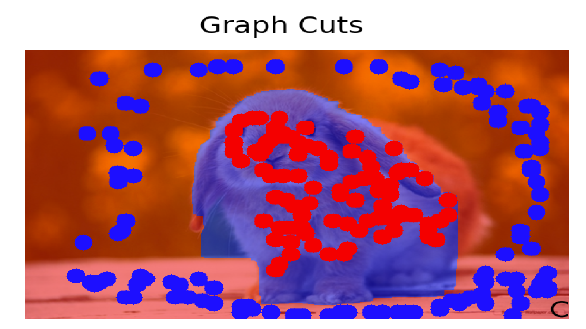
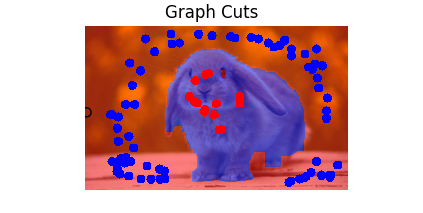
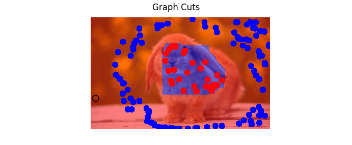
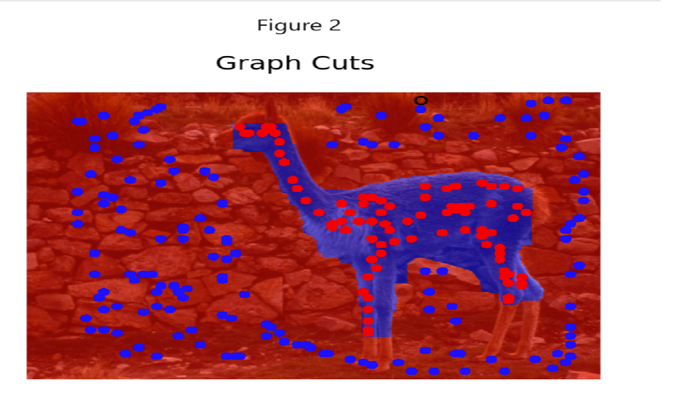
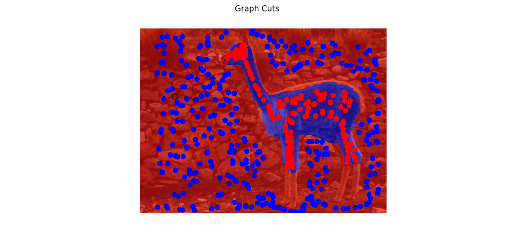
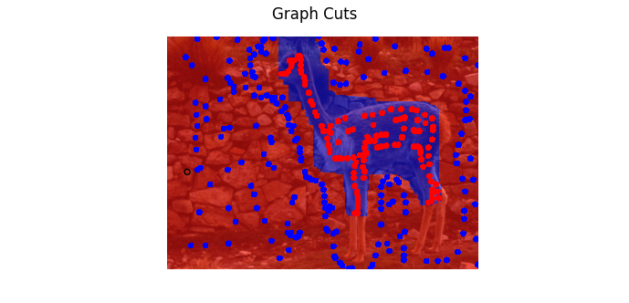

# Interactive graph-cut segmentation: colour baseline, GMM likelihood, DINO features

CS 484 (Computational Vision) course project, University of Waterloo, April 2026. Seed-based s/t graph-cut segmentation in a Jupyter notebook, evaluated in three variants on two images. The third variant, swapping raw colour for DINO ViT-S/8 deep features in the n-links, made results worse; the notebook records why and what would fix it.

| | Raw colour baseline | GMM colour likelihood | DINO deep features |
|---|---|---|---|
| bunny |  |  |  |
| llama |  |  |  |

All runs use lambda = 50, sigma = 30 and the same user-placed seeds.

## The three variants

1. **Raw colour baseline.** Foreground and background seeds are hard t-link constraints; n-links between neighbouring pixels are weighted by RGB contrast, so the cut prefers to follow colour edges.
2. **GMM colour likelihood.** A Gaussian mixture per segment is fitted to the seed pixels; for every unlabeled pixel the negative log-likelihood under each model becomes a soft t-link prior. N-links unchanged.
3. **DINO deep features.** Patch embeddings (384-d) from a pretrained DINO ViT-S/8 are upsampled to pixel resolution, reduced to 16 dimensions with PCA, and used in place of RGB in the n-link L2 weights. T-links unchanged from variant 1.

## What came out

- GMM improved on the baseline in both images: tighter boundaries and no region-level leakage in the upper body. Colour-overlap regions (the llama's lower legs, white fur against a pale background) stay hard for both.
- DINO features made segmentation worse than either baseline: the llama's head and torso are largely missed, the bunny's body fragments into alternating patches.
- Root cause, as written up in the notebook: DINO embeddings encode semantic similarity and are meant for cosine comparison, not local pixel contrast, so putting them into an L2-weighted n-link is a structural mismatch; stride-8 patches also introduce block boundaries after upsampling. PCA and min-max normalization only partly mitigate the scale problem.
- Proposed fix: use DINO attention maps as t-link priors, keeping colour contrast in the n-links, rather than replacing the n-link features.

## Run it

Open `proj4_draft_submit.ipynb`. Versions used: Python 3.12, PyTorch 2.5.1 (CUDA 12.1), torchvision 0.20.1, PyMaxflow 1.3.2, scikit-learn 1.8, NumPy 2.4, Matplotlib 3.10. The DINO weights download through `torch.hub` on first run. Seeds are placed interactively through the `GraphCutsPresenter` GUI in `asg1_error_handling.py`; the saved results for the seeds used in the write-up are in `demo/`.

## Files

```
proj4_draft_submit.ipynb   the project: three variants, results, conclusions
demo/                      result images referenced by the notebook
images/                    test images (bunny.bmp, lama.jpg and others)
asg1_error_handling.py     GUI scaffold: GraphCutsPresenter and a Figure wrapper
```

## Sources

`asg1_error_handling.py` and the files in `images/` were provided with the CS 484 assignments and are included so the notebook runs as submitted. The graph-cut, GMM and DINO code in the notebook is mine. DINO is from Facebook Research (`facebookresearch/dino`); max-flow from PyMaxflow.
